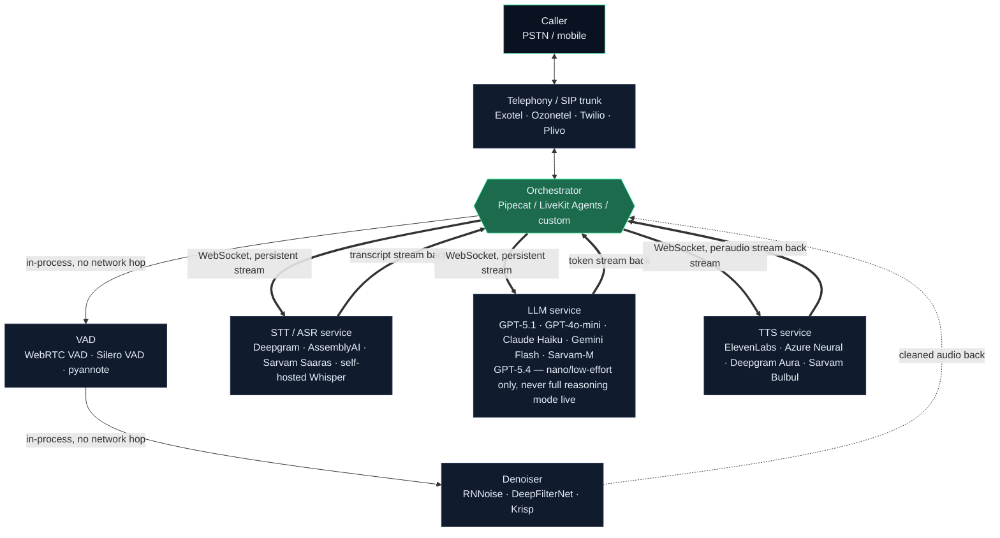

# Pipeline Architecture Diagram

## The real topology: orchestrator as a hub, not a straight line

STT, LLM, and TTS are **not** inline steps that hand off to each other
directly — they're independent microservices (usually separate vendor APIs,
each its own network endpoint). The **orchestrator** sits in the middle and
holds a persistent **WebSocket** connection open to each one, streaming
audio/text in and partial results back out in real time. VAD and the
denoiser, by contrast, typically run **in-process inside the orchestrator**
(or as a co-located sidecar) since they're lightweight and gain nothing from
being a separate network hop.

That distinction matters for latency: every orchestrator↔STT,
orchestrator↔LLM, and orchestrator↔TTS exchange is a **network round trip**,
even though the connection itself is long-lived and the handshake cost is
paid only once. Each message frame still has to cross the network — same
availability zone is cheap (a few ms), cross-region is not (tens of ms,
sometimes more) — and that adds up across three separate hops per turn.

Double arrows (`==`) mark a real network hop over WebSocket to an external
microservice; thin arrows mark an in-process/local call with no network cost.

## Stage-by-stage, in order

| # | Stage | Runs where | Purpose | Typical latency contribution |
|---|---|---|---|---|
| 1 | Telephony/SIP | Vendor network | Carries the call, hands audio frames to the orchestrator | 50-150ms (network hop, round trip) |
| 2 | VAD | In-process (orchestrator) | Detects when the caller has stopped speaking | ~5-40ms, no separate network hop |
| 3 | Denoiser | In-process (orchestrator) | Removes background noise/echo before STT sees the audio | 0-20ms, no separate network hop |
| 4 | Orchestrator to STT (WebSocket) | Network hop to STT vendor | Streams audio out, receives partial/final transcripts back | 150-1200ms (includes the STT provider's own processing time) + WebSocket RTT overhead |
| 5 | Orchestrator to LLM (WebSocket) | Network hop to LLM vendor | Streams transcript out, receives generated tokens back | 220ms-3s+ (includes the model's own time-to-first-token) + WebSocket RTT overhead |
| 6 | Orchestrator to TTS (WebSocket) | Network hop to TTS vendor | Streams text out, receives synthesized audio back | 100-1000ms (includes the TTS provider's own processing time) + WebSocket RTT overhead |
| 7 | Telephony (return) | Vendor network | Streams synthesized audio back to the caller | included in the telephony hop above |

**WebSocket RTT overhead** is on top of each vendor's own quoted
processing/first-byte latency — it's the network cost of the round trip
itself. Rough guide: **5-15ms** same-region/same-cloud, **20-60ms+**
cross-region or cross-cloud. Co-locating your orchestrator in the same
region as your STT/LLM/TTS vendors' nearest edge (see
`docs/01-tech-infrastructure.md`, section 1) is the main lever for keeping
this overhead small — it's paid three times per turn (once per service), so
it compounds if you're cross-region on all three.

VAD and the denoiser sit **before** the transcriber deliberately, and stay
in-process deliberately: VAD decides *when* to open the STT WebSocket call
(avoiding wasted round trips on silence/background noise), and the denoiser
cleans *what* gets sent — both improve STT accuracy without adding a network
hop of their own.

## Where to model this pipeline's numbers

- **Cost**: `cost-calculator/index.html` (or `calculator.py` for the CLI
  version) — monthly spend per stage at your call volume.
- **Latency**: `cost-calculator/latency-calculator.html` — per-stage and
  total end-to-end latency against the ~800ms natural-conversation target,
  including VAD, denoiser, and a per-hop WebSocket overhead input for the
  three orchestrator-to-service round trips shown above.
- Full provider pricing tables, the build-vs-fine-tune framework, and the
  latency budget table are in `docs/01-tech-infrastructure.md` and
  `docs/02-provider-vs-finetune-decision.md`.
